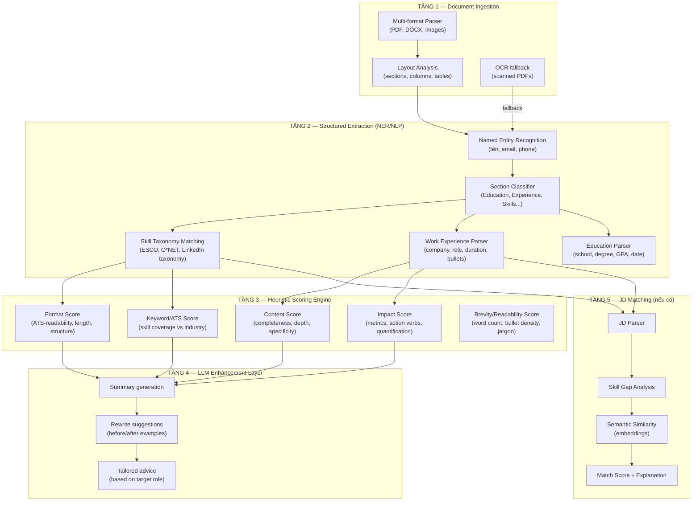
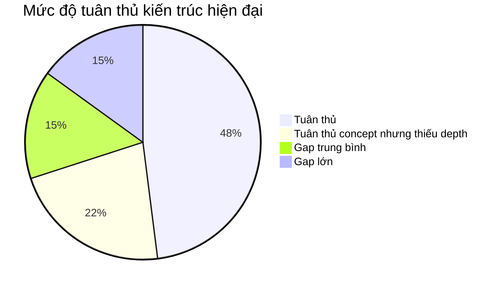

# So sánh kiến trúc: CV Doctor của bạn vs Hệ thống CV Doctor hiện đại

## Kiến trúc chuẩn của một CV Doctor hiện đại

Các hệ thống như **Jobscan**, **Resumeworded**, **VMock**, **Kickresume AI**, **Rezi.ai** đều chia thành các pipeline sau:



---

## So sánh từng tầng

### TẦNG 1 — Document Ingestion

| Component | Hệ thống hiện đại | Dự án của bạn | Gap |
|-----------|-------------------|---------------|-----|
| PDF text extraction | ✅ PDFBox / pdfplumber / pymupdf | ✅ PDFBox `Loader.loadPDF()` + `PDFTextStripper` | **Tuân thủ** |
| DOCX support | ✅ Apache POI / python-docx | ❌ Chỉ PDF | **Gap nhỏ** — DOCX phổ biến nhưng không critical |
| Image/scanned CV | ✅ OCR (Tesseract / Google Vision) | ❌ Throw error "file scan ảnh" | **Gap trung bình** — nhiều CV scan |
| Layout analysis | ✅ Phân tích column, table, header hierarchy | ❌ Chỉ `getText()` flat text | **Gap lớn** |
| File validation | ✅ Magic bytes + extension + size | ⚠️ Extension + content-type + size (thiếu magic bytes) | **Gap nhỏ** |
| Text normalization | ✅ Unicode normalize, whitespace collapse | ✅ `normalizeWhitespace()` + `normalizeForSearch()` | **Tuân thủ** |
| Text truncation | ✅ Token-based truncation | ⚠️ Character-based (8000 chars) | **Gap nhỏ** |

**Đánh giá tầng 1: 60% tuân thủ**

> [!NOTE]
> Phần lớn hệ thống CV Doctor **commercial** đều bắt đầu với PDF-only rồi mở rộng dần. Việc bạn chỉ hỗ trợ PDF ở giai đoạn ĐATN là hoàn toàn hợp lý. Gap lớn nhất là **layout analysis** — PDFTextStripper trả về flat text, mất toàn bộ thông tin về bố cục CV.

---

### TẦNG 2 — Structured Extraction

| Component | Hệ thống hiện đại | Dự án của bạn | Gap |
|-----------|-------------------|---------------|-----|
| Named Entity Recognition (NER) | ✅ spaCy/Flair NER: tên, email, phone, location | ❌ Không extract entities | **Gap lớn** |
| Section Classification | ✅ ML classifier hoặc rule-based section detection | ⚠️ Keyword-based: `containsAny("skills", "ky nang"...)` | **Gap trung bình** |
| Skill Taxonomy | ✅ ESCO / O*NET / LinkedIn Skills Graph (hàng nghìn skills + synonyms + hierarchy) | ⚠️ ~50 hardcoded + DB skills, no synonyms | **Gap lớn** |
| Experience Parser | ✅ Extract: company name, role title, date range, bullet points riêng biệt | ❌ Chỉ check `hasExperienceSection` boolean | **Gap rất lớn** |
| Education Parser | ✅ Extract: university, degree, major, GPA, graduation date | ❌ Chỉ check `hasEducationSection` boolean | **Gap rất lớn** |
| Skill Extraction | ✅ NER + taxonomy matching + context-aware | ⚠️ Substring matching (`contains()`) | **Gap lớn** |
| Years of Experience | ✅ Parse date ranges, tính tổng duration | ⚠️ Regex `\d{1,2}\+?\s*(nam\|years?)` | **Gap trung bình** |

**Đánh giá tầng 2: 25% tuân thủ**

> [!IMPORTANT]
> **Đây là tầng có gap lớn nhất.** Hệ thống hiện đại KHÔNG dùng LLM để extract structured data từ CV — họ dùng **NLP pipeline riêng** (NER models, section classifiers, date parsers) để tạo structured JSON trước. LLM chỉ đóng vai trò ở tầng 4 (generation).
>
> Dự án của bạn "nhảy" từ raw text → heuristic scoring (tầng 3) mà bỏ qua tầng 2. Kết quả là scoring dựa trên **boolean signals** ("có section kinh nghiệm hay không") thay vì **structured data** ("có 3 work entries, mỗi entry có 4 bullets, total 5 years").

Ví dụ cụ thể về sự khác biệt:

**Hệ thống hiện đại extract được:**
```json
{
  "experience": [
    {
      "company": "FPT Software",
      "role": "Backend Developer",
      "startDate": "2022-06",
      "endDate": "2024-12",
      "duration_months": 30,
      "bullets": [
        "Phát triển microservices xử lý 10K req/s bằng Spring Boot",
        "Giảm 40% response time qua Redis caching"
      ],
      "has_metrics": true,
      "action_verbs": ["phát triển", "giảm"],
      "technologies_mentioned": ["Spring Boot", "Redis", "microservices"]
    }
  ]
}
```

**Dự án của bạn extract được:**
```java
hasExperienceSection = true   // boolean
estimatedYears = 2            // regex match "2 năm"
hasMetrics = true             // regex match "40%"
detectedSkills = ["Spring Boot", "Redis"]  // substring match
```

Thông tin bị mất: số lượng work entries, bullet quality, action verb strength, date accuracy, role progression, company-specific context.

---

### TẦNG 3 — Heuristic Scoring Engine

| Component | Hệ thống hiện đại | Dự án của bạn | Gap |
|-----------|-------------------|---------------|-----|
| Format scoring | ✅ Dựa trên parsed sections, bullet count, page count, font consistency | ⚠️ Dựa trên boolean flags `hasSummarySection`, `hasSkillsSection`... | **Gap lớn** — scoring based on booleans vs structured data |
| Content scoring | ✅ Bullet depth analysis, action verb strength, specificity metrics | ⚠️ `hasExperienceSection` + skill count + estimated years | **Gap lớn** |
| Keyword/ATS scoring | ✅ Industry taxonomy matching, keyword density, skill categorization | ⚠️ `detectedSkills().size() * 8` | **Gap trung bình** |
| Impact scoring | ✅ Metric extraction per bullet, action verb classification (strong/weak/passive) | ⚠️ Boolean `hasMetrics` | **Gap lớn** |
| Overall formula | ✅ Weighted multi-factor, often with industry-specific adjustments | ✅ `format*0.20 + content*0.35 + keyword*0.25 + impact*0.20` | **Tuân thủ concept** |
| Score clamping | ✅ Bounds + business rules | ✅ `clampScore()` + conditional ceiling | **Tuân thủ** |
| Score override/ceiling | ✅ Hard constraints dựa trên critical signals | ✅ `if (skills.isEmpty()) keywordScore = min(20)` | **Tuân thủ** |

**Đánh giá tầng 3: 45% tuân thủ**

> [!NOTE]
> Bạn đã có **đúng framework scoring** (4 trục, weighted formula, clamping, ceiling). Vấn đề là **input quality** — scoring formula nhận boolean signals thay vì structured data, nên kết quả ít chi tiết hơn.

So sánh cụ thể `heuristicFormatScore()`:

```java
// === DỰ ÁN CỦA BẠN ===
private int heuristicFormatScore(CvSignalProfile sp) {
    int score = 35;
    if (sp.hasSummarySection())    score += 10;  // boolean
    if (sp.hasSkillsSection())     score += 18;  // boolean
    if (sp.hasExperienceSection()) score += 18;  // boolean
    if (sp.hasEducationSection())  score += 10;  // boolean
    if (sp.hasGithub()||sp.hasLinkedin()) score += 5;
    return clampScore(score);  // max = 96
}
```

```python
# === HỆ THỐNG HIỆN ĐẠI (pseudocode) ===
def format_score(parsed_cv):
    score = 0
    # Completeness (các section có mặt)
    score += 5 * len(parsed_cv.sections)           # 0-25 dựa trên số section
    # Structure quality
    score += 15 if parsed_cv.has_consistent_formatting else 0
    score += 10 if 1 <= parsed_cv.page_count <= 2 else -5
    # Bullet analysis
    avg_bullet_len = mean(len(b) for b in parsed_cv.all_bullets)
    score += 15 if 10 <= avg_bullet_len <= 25 else 5
    # ATS readability
    score += 10 if not parsed_cv.uses_tables else 0
    score += 10 if not parsed_cv.uses_images else 0
    score += 5 if parsed_cv.uses_standard_fonts else 0
    # Contact info completeness
    score += 5 if parsed_cv.has_email else 0
    score += 5 if parsed_cv.has_phone else 0
    return clamp(score, 0, 100)
```

---

### TẦNG 4 — LLM Enhancement Layer

| Component | Hệ thống hiện đại | Dự án của bạn | Gap |
|-----------|-------------------|---------------|-----|
| LLM role | ✅ **Chỉ generation** — viết summary, rewrite suggestions | ⚠️ **Scoring + generation** — LLM chấm điểm + viết summary | **Gap trung bình** |
| Score source | ✅ 100% deterministic từ heuristic engine | ⚠️ Hybrid: LLM score → overridden by heuristic ceiling | **Gần tuân thủ** |
| Suggestion quality | ✅ Before/after examples cụ thể cho từng bullet | ⚠️ Generic issue + suggestion, thiếu before/after | **Gap lớn** |
| Anti-hallucination | ✅ Structured output mode + output validation + grounding check | ⚠️ Instruction-only ("không được bịa") + enum normalization | **Gap trung bình** |
| Temperature control | ✅ Low temperature (0.0-0.3) cho scoring tasks | ❌ Default temperature | **Gap lớn** |
| Prompt versioning | ✅ Versioned prompts + A/B testing | ✅ `CV_ANALYSIS_PROMPT_VERSION = "cv-doctor-v2"` | **Tuân thủ concept** |
| Fallback | ✅ Graceful degradation to heuristic-only | ✅ Full heuristic fallback | **Tuân thủ** |

**Đánh giá tầng 4: 55% tuân thủ**

> [!TIP]
> Điểm **sáng nhất** của dự án bạn ở tầng này là **heuristic-first approach**: điểm số được tính bằng code, LLM chỉ bổ sung language. Đây chính xác là hướng mà các hệ thống hiện đại đang chuyển sang sau khi nhận ra LLM scoring không reproducible.
>
> Tuy nhiên, implementation hiện tại vẫn **yêu cầu LLM trả scores** rồi override — cách đúng hơn là **không yêu cầu LLM trả score**, chỉ yêu cầu summary + suggestions.

---

### TẦNG 5 — JD Matching

| Component | Hệ thống hiện đại | Dự án của bạn | Gap |
|-----------|-------------------|---------------|-----|
| JD parsing | ✅ Extract required skills, nice-to-have, responsibilities, qualifications | ⚠️ Dùng `job.getSkills()` từ DB (đã structured) | **Khác approach** — bạn dùng DB data thay vì parse JD text |
| Skill gap analysis | ✅ Exact + fuzzy + semantic matching | ⚠️ Exact match after normalize | **Gap trung bình** |
| Semantic similarity | ✅ Embedding cosine similarity (CV text vs JD text) | ❌ Không có embedding matching | **Gap lớn** |
| Experience level matching | ✅ Years + responsibilities depth | ✅ `computeExperienceMatch()` dựa trên level rank | **Tuân thủ concept** |
| Domain matching | ✅ Industry/domain classification | ✅ `computeDomainMatch()` + cross-domain similarity | **Tuân thủ** |
| Match explanation | ✅ Per-skill analysis + overall narrative | ✅ Evidence list + AI summary | **Tuân thủ** |
| Score = deterministic | ✅ Backend tính, LLM chỉ viết summary | ✅ `computeMatch()` → LLM summary only | **Tuân thủ** |

**Đánh giá tầng 5: 55% tuân thủ**

> [!NOTE]
> Matching pipeline của bạn có thiết kế concept đúng (deterministic score + LLM summary). Gap chính là thiếu **semantic matching** — "Machine Learning" trong CV và "ML/AI experience" trong JD là match ngữ nghĩa nhưng không match keyword.

---

## Tổng hợp mức độ tuân thủ



| Tầng | Tuân thủ | Đánh giá |
|------|----------|----------|
| 1 — Document Ingestion | 60% | PDF parsing OK, thiếu layout analysis |
| 2 — Structured Extraction | **25%** | **Gap lớn nhất** — thiếu NER/section parser |
| 3 — Heuristic Scoring | 45% | Đúng framework, thiếu input depth |
| 4 — LLM Enhancement | 55% | Heuristic-first đúng hướng, thiếu temperature/rubric |
| 5 — JD Matching | 55% | Deterministic scoring đúng, thiếu semantic matching |
| **Trung bình** | **~48%** | |

---

## Kiến trúc nào bạn đã làm ĐÚNG (so với industry)?

### ✅ 1. Heuristic-First, LLM-Second
Đây là **quyết định kiến trúc đúng nhất** trong project. Các hệ thống thế hệ đầu (2023-early 2024) gọi GPT rồi parse JSON → output thiếu nhất quán. Thế hệ mới (Resumeworded v3, Jobscan 2025) đều chuyển sang tính điểm bằng code, chỉ dùng LLM cho text generation.

### ✅ 2. Async Task Queue + SSE
Jobscan, Rezi.ai đều dùng mô hình submit → poll/stream kết quả. Không ai dùng synchronous request cho AI processing vì timeout risk.

### ✅ 3. Content-Hash Caching + Prompt Versioning
Production systems đều cache kết quả theo content hash. Prompt versioning cho phép invalidate cache khi upgrade prompt mà không mất dữ liệu cũ.

### ✅ 4. Deterministic Matching Score
Score matching tính bằng thuật toán, không phải LLM. Đây là pattern của Jobscan, Resumeworded — LLM chỉ viết explanation.

### ✅ 5. Comprehensive Fallback Chain
AI fail → heuristic result. Không có production system nào để AI failure crash toàn bộ feature.

### ✅ 6. Multi-axis Scoring (FORMAT/CONTENT/KEYWORD/IMPACT)
4 trục này map khá sát với các hệ thống thương mại. Resumeworded dùng 5 trục (+ Brevity), Jobscan dùng 3 trục lớn.

---

## Kiến trúc nào bạn CÒN THIẾU (so với industry)?

### ❌ 1. Structured CV Parsing (Gap lớn nhất)

Đây là **trái tim** của mọi CV Doctor hiện đại. Bạn đang nhảy từ raw text → scoring mà không qua bước parse CV thành structured data.

**Nếu muốn tuân thủ industry**, bước tiếp theo nên là:

```java
// Cần một CvParser trả về structured data
public record ParsedCv(
    ContactInfo contact,           // name, email, phone, location
    List<WorkEntry> experience,    // company, role, dates, bullets
    List<EducationEntry> education,// school, degree, major, gpa
    List<String> skills,           // extracted + normalized
    List<String> certifications,
    String summaryText,
    int pageCount,
    int totalBulletCount,
    double avgBulletWordCount
) {}
```

Cách implement khả thi cho ĐATN: **dùng LLM để parse** (gửi CV text, yêu cầu trả JSON structured) → rồi scoring dựa trên structured data thay vì boolean signals. Đây là cách nhiều startup nhỏ làm khi chưa có budget train NER model riêng.

### ❌ 2. Skill Taxonomy / Synonym Mapping

Production systems dùng bộ taxonomy hàng **nghìn skills** với synonym graph:
```
"React" ↔ "ReactJS" ↔ "React.js" ↔ "React JS"
"Spring Boot" → parent: "Spring Framework" → parent: "Java Ecosystem"
"AWS" → subcategories: "EC2", "S3", "Lambda", "RDS"...
```

Dự án bạn có ~50 hardcoded skills + DB skills, matching bằng `contains()`.

### ❌ 3. Before/After Rewrite Suggestions

Hệ thống hiện đại trả gợi ý dạng:

> **Trước**: "Làm việc với database"
> **Sau**: "Thiết kế và tối ưu schema PostgreSQL cho hệ thống 500K users, giảm 35% query time bằng proper indexing"

Dự án bạn trả gợi ý dạng:
> **Issue**: "Mô tả kinh nghiệm chưa đủ chiều sâu kỹ thuật"
> **Suggestion**: "Với mỗi dự án, hãy ghi rõ vai trò, stack, phạm vi công việc..."

### ❌ 4. Semantic Matching (Embeddings)

Matching hiện tại chỉ dùng **exact keyword match** sau normalize. Hệ thống hiện đại dùng embedding similarity để:
- "Machine Learning" ↔ "ML/AI" (semantic match)
- "Team lead 5 engineers" ↔ "Leadership experience required" (concept match)
- "Deployed to AWS ECS" ↔ "Cloud infrastructure experience" (domain match)

Thú vị là bạn **đã có VectorStore (Pinecone)** cho chatbot nhưng chưa dùng cho CV matching.

### ❌ 5. ATS Compatibility Check

Một phần quan trọng của CV Doctor thương mại là kiểm tra **ATS (Applicant Tracking System) readability**: CV có dùng bảng không, có dùng header/footer không, có dùng image-based text không, font có standard không. Bạn mất thông tin này khi `PDFTextStripper` flatten mọi thứ thành text.

---

## Kết luận: Ở đâu trên phổ kiến trúc?

```
Mức 1: "Gọi ChatGPT, paste CV, hiển thị kết quả"
  ↓
Mức 2: "Có heuristic fallback + caching"                    ← bạn bắt đầu ở đây
  ↓
Mức 3: "Heuristic scoring + LLM chỉ làm text generation"   ← bạn đã đạt ở đây ✅
  ↓
Mức 4: "Structured CV parsing + rich heuristic scoring"     ← industry standard
  ↓
Mức 5: "NER/ML pipeline + skill taxonomy + semantic match"  ← top-tier (Jobscan, VMock)
```

**Dự án của bạn ở Mức 3/5** — cao hơn đáng kể so với phần lớn ĐATN/side-project AI (thường ở mức 1-2), nhưng thiếu tầng structured extraction (mức 4) mà các hệ thống thương mại coi là bắt buộc.

**Tin tốt**: Kiến trúc hiện tại của bạn **có thể nâng lên mức 4** mà không cần refactor lớn — chỉ cần thêm một bước LLM-based structured extraction giữa text extraction và scoring, rồi update scoring functions nhận structured data thay vì boolean signals. Mọi infrastructure khác (async queue, caching, fallback, SSE) đã sẵn sàng cho mức 4-5.
