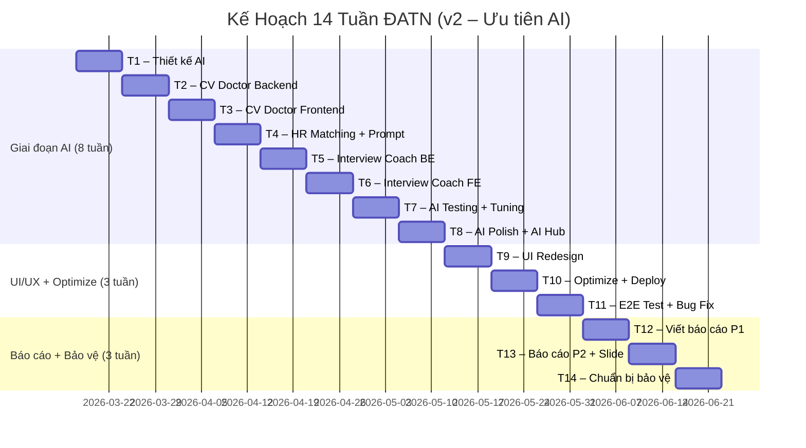

# 📋 Kế Hoạch 14 Tuần Làm Đồ Án Tốt Nghiệp (v2)

> **Đề tài**: Xây dựng website tuyển dụng việc làm IT tích hợp AI (JobFind)
> **Sinh viên**: Hoàng Công Tùng – 20225947
> **Thời gian**: 14 tuần (bắt đầu 17/03/2026)
> **Trọng tâm**: Dành **8 tuần (57%)** cho 3 tính năng AI để đạt chất lượng và hiệu suất tốt nhất

---

## 🎯 3 Tính Năng AI Cần Phát Triển

| # | Tính năng | Người dùng | Mô tả |
|---|-----------|-----------|-------|
| 1 | **CV Doctor** | Ứng viên | Upload CV → AI chấm điểm + gợi ý cải thiện |
| 2 | **CV–JD Matching cho HR** | Nhà tuyển dụng | AI tính % phù hợp giữa CV ứng viên với Job → HR lọc nhanh |
| 3 | **Interview Coach** | Ứng viên | AI mô phỏng phỏng vấn kỹ thuật, chấm điểm từng câu trả lời |

---

## 📅 Tổng Quan Timeline



| Giai đoạn | Tuần | % Thời gian |
|-----------|------|-------------|
| 🤖 **Tính năng AI** (CV Doctor + HR Matching + Interview Coach) | 8 tuần | **57%** |
| 🎨 UI/UX + Optimize + Testing | 3 tuần | 21% |
| 📝 Báo cáo + Bảo vệ | 3 tuần | 22% |

---

## 📅 Chi Tiết Từng Tuần

---

### 🗓️ TUẦN 1 (17/03 – 23/03): Phân Tích & Thiết Kế Tổng Thể AI

> **Mục tiêu**: Hoàn thành bản thiết kế chi tiết cho cả 3 tính năng AI

| Ngày | Công việc |
|------|-----------|
| T2 | Nghiên cứu sản phẩm tham khảo (Jobscan, Resume Worded, Pramp, Interviewing.io) – phân tích UX/flow |
| T3 | Thiết kế luồng nghiệp vụ (flowchart) cho CV Doctor + CV–JD Matching cho HR |
| T4 | Thiết kế luồng nghiệp vụ cho Interview Coach |
| T5 | Thiết kế Database Schema: 3 bảng mới (`cv_analyses`, `interview_sessions`, `interview_messages`) + cập nhật bảng `resumes` |
| T6 | Thiết kế API endpoints chi tiết (request/response format, error cases) |
| T7 | Wireframe UI cho 3 tính năng (dùng Figma hoặc vẽ tay) |

**Deliverables:**
- [ ] Flowchart & ERD diagram
- [ ] Tài liệu API design (Swagger format)
- [ ] Wireframe UI cho CV Doctor, HR Matching, Interview Coach
- [ ] Thêm dependency PDFBox vào [build.gradle.kts](file:///d:/DATN-20225947/01-java-spring-jobfind-starter/build.gradle.kts)

---

### 🗓️ TUẦN 2 (24/03 – 30/03): CV Doctor – Backend Core

> **Mục tiêu**: Backend hoàn chỉnh: upload CV → parse PDF → LLM phân tích → trả kết quả JSON

| Ngày | Công việc |
|------|-----------|
| T2 | Tạo entity `CvAnalysis` + `CvAnalysisRepository` + DTOs (request/response) |
| T3 | Xây dựng `CvDoctorService.extractTextFromPdf()` – đọc PDF bằng PDFBox, xử lý edge cases (file rỗng, file lỗi, file quá lớn) |
| T4 | Viết **prompt template v1** cho phân tích CV (4 tiêu chí: Format/Content/Keyword/Impact), yêu cầu trả JSON |
| T5 | Xây dựng `CvDoctorService.analyzeCV()` – ghép nối: parse PDF → build prompt → gọi ChatModel → parse JSON response |
| T6 | Tạo `CvDoctorController`: `POST /api/v1/ai/cv/analyze` (multipart upload) + `GET /api/v1/ai/cv/history` |
| T7 | Test API qua Swagger với 5-10 CV mẫu khác nhau, **tinh chỉnh prompt lần 1** dựa trên kết quả thực tế |

**Deliverables:**
- [ ] Entity `CvAnalysis` (id, userId, fileName, overallScore, formatScore, contentScore, keywordScore, impactScore, summary, suggestions JSON, strengths JSON)
- [ ] API upload + analyze hoạt động end-to-end
- [ ] Prompt template v1 cho kết quả hợp lý với ≥5 CV mẫu
- [ ] Error handling: file không phải PDF, file rỗng, LLM timeout

---

### 🗓️ TUẦN 3 (31/03 – 06/04): CV Doctor – Frontend & Hoàn Thiện

> **Mục tiêu**: Giao diện CV Doctor hoàn chỉnh, đẹp, smooth

| Ngày | Công việc |
|------|-----------|
| T2 | Tạo route `/cv-doctor` + API function `callAnalyzeCV()` trong [api.ts](file:///d:/DATN-20225947/FE-JobFind/src/config/api.ts) |
| T3 | Xây dựng component **Upload Area** – Ant Design `Upload.Dragger` (drag & drop), validate chỉ nhận PDF, hiển thị tên file + kích thước |
| T4 | Xây dựng component **Loading State** – animation skeleton + progress steps ("Đang đọc CV..." → "Đang phân tích..." → "Hoàn thành!") |
| T5 | Xây dựng component **Score Dashboard** – Circular Progress (điểm tổng), 4 thanh progress bar (Format/Content/Keyword/Impact), màu sắc theo mức (đỏ < 50, vàng 50-75, xanh > 75) |
| T6 | Xây dựng component **Suggestions List** – card cho mỗi gợi ý (icon priority, category tag, issue + suggestion), có thể collapse/expand |
| T7 | Style tổng thể (SCSS module), responsive, micro-animation (score count-up, progress bar animate), test tích hợp FE↔BE |

**Deliverables:**
- [ ] Trang CV Doctor hoàn chỉnh (upload → loading → kết quả)
- [ ] Score dashboard với animation
- [ ] Danh sách gợi ý chi tiết
- [ ] Lịch sử phân tích CV (danh sách các lần phân tích trước)

---

### 🗓️ TUẦN 4 (07/04 – 13/04): CV–JD Matching Cho HR + Prompt Optimization

> **Mục tiêu**: HR có thể xem % phù hợp của mỗi CV với Job + Tối ưu prompt cho CV Doctor

| Ngày | Công việc |
|------|-----------|
| T2 | Thêm trường `ai_match_score` + `ai_match_summary` vào entity [Resume](file:///d:/DATN-20225947/01-java-spring-jobfind-starter/src/main/java/vn/hoangtung/jobfind/domain/Resume.java#22-73). Viết `CvDoctorService.matchCvWithJob(resumeId, jobId)` – lấy CV text + Job Description → prompt so sánh → trả % matching |
| T3 | Tạo API `POST /api/v1/ai/cv/match` (nhận resumeId + jobId). Viết **prompt template cho matching** – yêu cầu AI so sánh skills, experience, level rồi trả JSON {matchScore, matchedSkills, missingSkills, summary} |
| T4 | **Frontend HR**: Thêm nút "🤖 AI Đánh Giá" trên trang Admin Resume → khi click, gọi API matching → hiển thị % score + tooltip chi tiết |
| T5 | Thêm cột **"% Phù Hợp"** trong bảng Resume admin → cho phép **sort theo điểm AI** giảm dần. Thêm filter: "Chỉ hiện CV ≥ 70%" |
| T6 | **Prompt Optimization Sprint (CV Doctor)**: Test với 15-20 CV đa dạng (junior/senior, tốt/kém, tiếng Việt/Anh). So sánh output → tinh chỉnh prompt v2: cải thiện tính nhất quán điểm số, gợi ý cụ thể hơn |
| T7 | **Prompt Optimization Sprint (Matching)**: Test matching với nhiều cặp CV–JD, điều chỉnh trọng số (ưu tiên skills match > experience > education). Đảm bảo score hợp lý và ổn định |

**Deliverables:**
- [ ] API matching CV–JD hoạt động
- [ ] HR thấy % phù hợp trên trang Admin Resume
- [ ] Sort/filter CV theo AI score
- [ ] Prompt v2 (CV Doctor) cho kết quả ổn định trên 20+ CV mẫu
- [ ] Prompt v1 (Matching) cho kết quả hợp lý trên 10+ cặp CV–JD

---

### 🗓️ TUẦN 5 (14/04 – 20/04):  – Backend Core
Interview Coach
> **Mục tiêu**: Backend hoàn chỉnh cho mô phỏng phỏng vấn: tạo session → sinh câu hỏi → đánh giá trả lời → tổng kết

| Ngày | Công việc |
|------|-----------|
| T2 | Tạo entities: `InterviewSession` + `InterviewMessage` + repositories + DTOs. Enum: `SessionStatus` (IN_PROGRESS, COMPLETED), `QuestionType` (TECHNICAL, BEHAVIORAL, PROBLEM_SOLVING), `DifficultyLevel` (EASY, MEDIUM, HARD) |
| T3 | Xây dựng `InterviewCoachService.startSession(config)` – tạo session, sinh câu hỏi đầu tiên. Viết **prompt sinh câu hỏi**: nhận jobTitle + level + techStack + questionType → trả JSON {question, expectedKeyPoints, timeLimit} |
| T4 | Xây dựng `InterviewCoachService.submitAnswer(sessionId, answer)` – nhận câu trả lời, đánh giá, sinh câu hỏi tiếp. Viết **prompt đánh giá**: nhận question + answer + expectedKeyPoints → trả JSON {score, feedback, betterAnswer} |
| T5 | Xây dựng `InterviewCoachService.endSession(sessionId)` – tính điểm tổng, sinh bản tổng kết. Viết **prompt tổng kết**: nhận toàn bộ Q&A → trả JSON {totalScore, strengths, weaknesses, overallFeedback, skillRadar} |
| T6 | Tạo `InterviewCoachController` với 5 endpoints: start, answer, getSession, history, end |
| T7 | Test toàn bộ flow qua Swagger: tạo session → trả lời 5 câu → kết thúc → xem tổng kết. Fix bugs, **tinh chỉnh prompt lần 1** |

**Deliverables:**
- [ ] 2 entities + migration
- [ ] 3 prompt templates (sinh câu hỏi, đánh giá, tổng kết)
- [ ] 5 API endpoints hoạt động end-to-end
- [ ] Flow phỏng vấn 5 câu chạy mượt qua Swagger

---

### 🗓️ TUẦN 6 (21/04 – 27/04): Interview Coach – Frontend

> **Mục tiêu**: Giao diện phỏng vấn mô phỏng chuyên nghiệp, trải nghiệm mượt mà

| Ngày | Công việc |
|------|-----------|
| T2 | Tạo route `/interview-coach`, Redux slice mới (`interviewSlide.ts`), API functions |
| T3 | **Setup Page** – Form wizard 3 bước: Chọn vị trí (có thể gợi ý từ jobs trên hệ thống) → Chọn level (Junior/Mid/Senior với mô tả) → Chọn tech stack (multi-select skills) + số câu hỏi (5/7/10) |
| T4 | **Interview Page** – Giao diện giống phòng phỏng vấn: avatar AI interviewer, bubble câu hỏi, textarea trả lời (có character count), nút Submit + Skip, timer đếm ngược, progress bar (câu 3/5) |
| T5 | **Real-time Feedback** – Sau mỗi câu trả lời: hiển thị score nhỏ + feedback ngắn (collapse) trước khi chuyển câu tiếp → tạo cảm giác "phỏng vấn thật" |
| T6 | **Summary Report Page** – Radar Chart (Recharts) cho 4 kỹ năng, điểm tổng lớn (circular), bảng chi tiết từng câu (question + answer + score + feedback + better answer), nút "Phỏng vấn lại" |
| T7 | Style tổng thể, responsive, animation (typing indicator khi AI "suy nghĩ", score reveal animation), test tích hợp FE↔BE |

**Deliverables:**
- [ ] Wizard cấu hình (3 bước)
- [ ] Giao diện phỏng vấn real-time
- [ ] Summary report với Radar chart
- [ ] Toàn bộ flow hoạt động mượt FE↔BE

---

### 🗓️ TUẦN 7 (28/04 – 04/05): AI Quality Testing + Prompt Tuning

> **Mục tiêu**: Đảm bảo cả 3 tính năng AI cho kết quả **chính xác, nhất quán, hữu ích**. Đây là tuần quan trọng nhất để nâng chất lượng AI.

| Ngày | Công việc |
|------|-----------|
| T2 | **Tạo bộ test data**: 20 CV mẫu đa dạng (5 junior tốt, 5 junior kém, 5 senior tốt, 5 senior kém). 10 Job descriptions khác nhau. Chạy CV Doctor → ghi nhận điểm → kiểm tra tính nhất quán (CV tốt phải > 70, CV kém phải < 50) |
| T3 | **Tinh chỉnh Prompt CV Doctor v3**: Thêm rubric chi tiết hơn cho từng khoảng điểm. Thêm few-shot examples (CV 85/100 trông thế nào vs CV 45/100). Test lại với 20 CV → so sánh kết quả v2 vs v3 |
| T4 | **Test HR Matching**: 10 cặp CV–JD (5 match tốt, 5 không match). Kiểm tra: CV Java developer + JD Java → score cao? CV Java + JD Python → score thấp? Tinh chỉnh prompt matching v2 |
| T5 | **Test Interview Coach**: Chạy 5 session hoàn chỉnh (Junior Java, Mid React, Senior System Design...). Kiểm tra: câu hỏi có đúng level? Đánh giá có công bằng? Follow-up có logic? |
| T6 | **Tinh chỉnh Prompt Interview Coach v2**: Cải thiện đa dạng câu hỏi (tránh lặp), feedback cụ thể hơn, better answer thực sự hữu ích. Thêm context về thị trường IT Việt Nam |
| T7 | **Performance & Error Handling**: Đo thời gian response trung bình. Thêm timeout handling (nếu LLM > 30s → retry 1 lần → fallback message). Thêm rate limit protection. Test edge cases: CV tiếng Anh, CV rất ngắn, câu trả lời rỗng |

**Deliverables:**
- [ ] Bộ test data: 20 CV + 10 JD + 5 interview scenarios
- [ ] Prompt v3 (CV Doctor) – kết quả nhất quán trên 20 CV
- [ ] Prompt v2 (Matching) – scoring hợp lý trên 10 cặp
- [ ] Prompt v2 (Interview) – câu hỏi đa dạng, đánh giá công bằng
- [ ] Response time < 15 giây cho mỗi AI call
- [ ] Error handling hoàn chỉnh (timeout, rate limit, invalid input)

---

### 🗓️ TUẦN 8 (05/05 – 11/05): AI Polish + AI Hub + Chatbot Upgrade

> **Mục tiêu**: Polish tất cả tính năng AI, tạo AI Hub, nâng cấp Chatbot

| Ngày | Công việc |
|------|-----------|
| T2 | **CV Doctor bổ sung**: Cho phép ứng viên chọn JD cụ thể trên hệ thống để so sánh (reuse logic matching). Thêm nút "Tải báo cáo PDF" (export kết quả phân tích) |
| T3 | **Interview Coach bổ sung**: Lịch sử session (danh sách các buổi phỏng vấn cũ), xem lại chi tiết session. Nút "Phỏng vấn lại cùng cấu hình" |
| T4 | **Nâng cấp Chatbot hiện tại**: Thêm Markdown rendering (bold, list, code block), suggested questions chips, avatar bot, sound notification |
| T5 | **Tạo trang AI Hub** (`/ai-hub`) – Landing page giới thiệu 3 tính năng AI (CV Doctor, Interview Coach, Chatbot) với icon, mô tả ngắn, nút CTA "Thử ngay". Hero section với animation |
| T6 | **Thêm AI Hub vào Navigation**: Menu header có mục "AI Tools" dropdown (CV Doctor, Interview Coach, Chatbot). Banner quảng bá AI Hub trên trang Home |
| T7 | **Tổng review AI**: Chạy lại toàn bộ flow cả 3 tính năng, fix bugs cuối cùng, đảm bảo UX mượt mà |

**Deliverables:**
- [ ] CV Doctor: so sánh với JD + export PDF
- [ ] Interview Coach: lịch sử + phỏng vấn lại
- [ ] Chatbot nâng cấp (markdown, suggestions)
- [ ] AI Hub landing page
- [ ] Navigation cập nhật

---

### 🗓️ TUẦN 9 (12/05 – 18/05): Cải Thiện UI/UX + Chức Năng Bổ Sung

> **Mục tiêu**: Nâng cấp giao diện toàn bộ ứng dụng

| Ngày | Công việc |
|------|-----------|
| T2 | Redesign **Home Page**: Hero animation, stats counter, featured jobs, AI features banner |
| T3 | Redesign **Job Listing + Detail**: Filter sidebar, card layout, skeleton loading, 2-column detail layout |
| T4 | Redesign **Company pages** + xây dựng trang **Profile/Quản lý tài khoản** |
| T5 | Redesign **Login & Register** + Cải thiện **Admin Dashboard** (Recharts: thống kê jobs, users, resumes, top skills) |
| T6 | **Responsive Design** toàn bộ (mobile menu, breakpoint tuning) |
| T7 | **Notification system** (toast + dropdown) + Cross-browser testing |

**Deliverables:**
- [ ] Tất cả trang client redesign
- [ ] Profile page + Admin dashboard charts
- [ ] Responsive trên mọi kích thước
- [ ] Notification system

---

### 🗓️ TUẦN 10 (19/05 – 25/05): Optimization + Deploy

> **Mục tiêu**: Tối ưu hiệu suất + triển khai hệ thống

| Ngày | Công việc |
|------|-----------|
| T2 | **Backend**: Error handling nhất quán, validation DTOs, security hardening (CORS, rate limit AI APIs), logging |
| T3 | **Backend**: Database optimization (indexes, N+1 check), unit tests cho AI services |
| T4 | **Frontend**: Code splitting (React.lazy), memoization, image lazy loading, bundle analysis |
| T5 | **Frontend**: SEO (meta tags, Open Graph, title tags), Lighthouse audit |
| T6 | **Deploy**: Docker Compose (MySQL + Spring Boot + Nginx + React), environment config |
| T7 | Deploy lên VPS/Cloud, test production, seed data mẫu thực tế |

**Deliverables:**
- [ ] Backend optimized + tested
- [ ] Frontend Lighthouse ≥ 80
- [ ] Docker Compose + deployed

---

### 🗓️ TUẦN 11 (26/05 – 01/06): E2E Testing + Bug Fix

> **Mục tiêu**: Testing toàn diện, fix tất cả bugs

| Ngày | Công việc |
|------|-----------|
| T2 | E2E: Đăng ký → Đăng nhập → Tìm job → Apply (upload CV) → CV Doctor → Interview Coach |
| T3 | E2E: Admin flows (CRUD jobs/companies/users, view resumes, AI matching) |
| T4 | E2E: AI accuracy test cuối cùng (CV Doctor + Matching + Interview Coach) |
| T5-T6 | **Bug Fix Sprint** – fix tất cả issues, UI polish cuối cùng |
| T7 | Chuẩn bị seed data mẫu đẹp cho demo (5 companies, 20 jobs, 10 users, 15 resumes) |

**Deliverables:**
- [ ] Test report (pass/fail)
- [ ] Zero critical bugs
- [ ] Demo data sẵn sàng

---

### 🗓️ TUẦN 12 (02/06 – 08/06): Viết Báo Cáo (Phần 1)

| Ngày | Công việc |
|------|-----------|
| T2 | **Chương 1**: Giới thiệu (bối cảnh, mục tiêu, phạm vi, phương pháp) |
| T3 | **Chương 2**: Cơ sở lý thuyết (Spring Boot, React, Spring AI, RAG, LLM, Prompt Engineering, Vector DB) |
| T4-T5 | **Chương 3**: Phân tích & Thiết kế (Use Case, Class Diagram, ERD, Sequence Diagram, API design) |
| T6-T7 | **Chương 4 (phần 1)**: Triển khai core (kiến trúc, code structure, demo CRUD + Auth) |

**Deliverables:**
- [ ] Chương 1-3 hoàn thành
- [ ] Chương 4 bắt đầu
- [ ] UML diagrams

---

### 🗓️ TUẦN 13 (09/06 – 15/06): Viết Báo Cáo (Phần 2) + Slide

| Ngày | Công việc |
|------|-----------|
| T2-T3 | **Chương 4 (phần 2)**: Demo chi tiết 3 tính năng AI – kiến trúc pipeline, prompt engineering, screenshots |
| T4 | **Chương 5**: Kết luận (đánh giá, hạn chế, hướng phát triển) |
| T5 | Format báo cáo: mục lục, danh mục hình/bảng, tài liệu tham khảo |
| T6-T7 | **Slide thuyết trình** (15-20 slides) + **Video demo** (3 phút) |

**Deliverables:**
- [ ] Báo cáo ĐATN hoàn chỉnh (PDF)
- [ ] Slide 15-20 trang
- [ ] Video demo 3 phút

---

### 🗓️ TUẦN 14 (16/06 – 22/06): Chuẩn Bị Bảo Vệ

| Ngày | Công việc |
|------|-----------|
| T2 | Tập thuyết trình (15 phút) |
| T3 | Chuẩn bị câu hỏi phản biện dự đoán + câu trả lời (Tại sao Groq? RAG vs Fine-tuning? Security? Prompt injection?) |
| T4 | Kiểm tra demo lần cuối – server chạy ổn, data mẫu đẹp |
| T5 | Tập thuyết trình lần 2 với bạn bè, nhận feedback |
| T6 | Chuẩn bị D-Day: in báo cáo, backup demo offline, kiểm tra thiết bị |
| T7 | 🎉 **BẢO VỆ ĐỒ ÁN** |

**Deliverables:**
- [ ] Thuyết trình 15 phút mượt mà
- [ ] Sẵn sàng phản biện
- [ ] Demo ổn định + backup

---

## 🧠 Chi Tiết Pipeline AI Cho Từng Tính Năng

### Pipeline 1: CV Doctor (Ứng viên)
```
Upload PDF ──→ PDFBox Parse ──→ Build Prompt (CV text + rubric) ──→ Groq LLM ──→ Parse JSON ──→ Save DB ──→ Display Score + Suggestions
                                        │
                                 Temperature: 0.3
                                 (cần nhất quán)
```

### Pipeline 2: CV–JD Matching (HR)
```
Resume (đã có) ──→ Lấy CV PDF ──→ PDFBox Parse ──→ Build Prompt (CV text + JD text) ──→ Groq LLM ──→ Parse JSON ──→ Update Resume.aiMatchScore ──→ Display % + Sort
                   Lấy Job Description ────────┘
                                        │
                                 Temperature: 0.2
                               (cần chính xác cao)
```

### Pipeline 3: Interview Coach
```
Config (title, level, stack) ──→ Build Prompt (generate question) ──→ Groq LLM ──→ Display Question
                                                                          │
User Answer ──→ Build Prompt (evaluate: question + answer + keyPoints) ──→ Groq LLM ──→ Score + Feedback ──→ Next Question
                                                                          │
End Session ──→ Build Prompt (summarize all Q&A) ──→ Groq LLM ──→ Report + Radar Chart
                                        │
                                 Temperature: 0.7
                               (cần đa dạng câu hỏi)
```

---

## ⚡ Chiến Lược Đảm Bảo Hiệu Suất AI

| Vấn đề | Giải pháp |
|--------|-----------|
| LLM response chậm | Groq LPU (500 token/s) + loading animation + streaming (nếu cần) |
| Kết quả không nhất quán | Temperature thấp (0.2-0.3) + few-shot examples + rubric rõ ràng |
| JSON parse lỗi | Try-catch + retry 1 lần + regex fallback extract |
| Rate limit Groq (30 req/min) | Queue requests + debounce từ FE + cache kết quả CV cũ |
| Prompt injection | Input sanitization + system prompt cứng + max token limit |
| CV scan (ảnh, không có text) | Detect text rỗng → thông báo "Vui lòng upload CV dạng text, không phải ảnh scan" |

> [!TIP]
> **Tuần 7 là tuần then chốt**: Dành trọn 1 tuần chỉ để test + tinh chỉnh prompt. Đây là sự khác biệt giữa AI "demo được" và AI "thực sự hữu ích". Hội đồng sẽ ấn tượng khi thấy AI cho kết quả **chính xác và nhất quán**.
